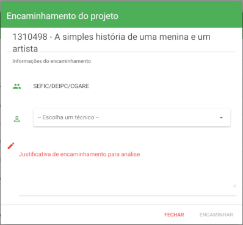
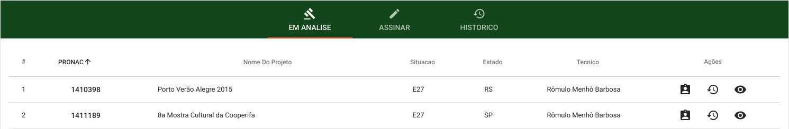
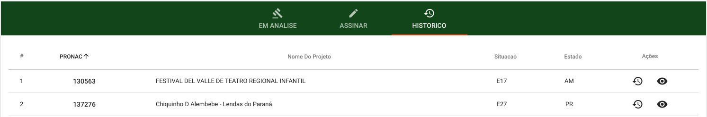

# Documentação Parecer Técnico

## Como acessar os Pareceres Técnicos no perfil de Coordenador de Prestação de Contas

* Primeiro passo, é necessário estar logado em um perfil de Coordenador de Prestação de Contas.
* Segundo passo selecione a opção Avaliação de Resultados localizada no menu superior e clique na opção Analisar Parecer.

## Abas

1. ENCAMINHAR
2. EM ANALISE
3. ASSINAR
4. HISTORICO

## Encaminhar

Para visualizar a lista dos projetos aguardando serem encaminhados a um técnico de prestação de contas é necessário selecionar a aba ENCAMINHAR.

Há uma lista dos projetos a serem encaminhados, havendo a possibilidade de visualizar os dados do projeto ao clicar no número do Pronac e a possibilidade de encaminhar o projeto a um técnico de prestação de contas.

### Ações disponíveis:

#### 1. Encaminhar Projeto

* Primeiro passo, é necessário clicar na ação Encaminhar Projeto.
* Após a abertura do formulário de encaminhamento é preciso selecionar um técnico de prestação de contas e digitar uma justificativa de encaminhamento, para finalizar clique em ENCAMINHAR.

## Em Análise

Para visualizar a lista dos projetos aguardando a assinatura do técnico de prestação de contas é necessário selecionar a aba EM ANALISE.

### Ações disponíveis:

#### 1. [Encaminhar Projeto](#1.-encaminhar-projeto)
Esta ação tem como objetivo reencaminhar o projeto a outro técnico de prestação de contas.

#### 2. Histórico de Encaminhamentos
Visualizar o histórico de encaminhamentos do projeto.

#### 3. Visualizar Projeto
Ao clicar na ação, é aberta a planilha orçamentaria do projeto.

Dentro da planilha é possível(de acordo com a numeração da imagem acima):
1. Visualizar dados sobre o projeto.
2. Visualizar dados acerca da consolidação do projeto.
3. Visualizar os comprovantes dos items de custo quando disponíveis.

## Assinar

Para visualizar a lista de projetos já assinados pelos respectivos técnicos e aguardando assinatura do coordenador de prestação de contas, é necessário selecionar aba ASSINAR.

### Ações disponíveis:

#### 1. Histórico de Encaminhamentos

Visualizar o histórico de encaminhamentos do projeto.

#### 2. Assinar

* Para assinar o projeto é necessário clicar na segunda ação disponível(Assinar)
* Logo após será aberta a planilha orçamentária semelhante a da ação [Visualizar Projeto](#3.-visualizar-projeto) mas com um menu flutuante presente no canto inferior direito da tela.
* Posicione o cursor do mouse em cima deste menu e selecione a ação Assinar assim como é mostrado na imagem abaixo.

* Após isso será apresentado na tela o Parecer Técnico de Avaliação de Resultado, role até o final da página e encontre opções de imprimir este, gerar o .pdf deste documento e o botão de ASSINAR efetivamente o projeto.

#### 3. Devolver Projeto

Ao selecionar a ação de Devolver Projeto, o coordenador de prestação de contas devolve o projeto assinado ao técnico de prestação de contas para que este seja analisado novamente.

Para concluir a devolução basta confirmar clicando no botão SIM.

#### 4. [Visualizar Projeto](#3.-visualizar-projeto)

Ao clicar na ação, é aberta a planilha orçamentaria do projeto.

## Historico

### Ações disponíveis:

#### 1. Histórico de Encaminhamentos

Visualizar o histórico de encaminhamentos do projeto.

#### 2. [Visualizar Projeto](#3.-visualizar-projeto)

Ao clicar na ação, é aberta a planilha orçamentaria do projeto.

---

## Como acessar os Pareceres Técnicos no perfil de Técnico de Prestação de Contas

* Primeiro passo, é necessário estar logado em um perfil de Técnico de Prestação de Contas.
* Segundo passo selecione a opção Avaliação de Resultados localizada no menu superior e clique na opção Analisar Parecer.

## Abas

1. EM ANALISE
2. ASSINAR
3. HISTORICO

## Em Análise

Para visualizar a lista dos projetos aguardando a análise do técnico logado é necessário selecionar a aba EM ANALISE.

### Ações disponíveis:

#### 1. Histórico de Encaminhamentos
Visualizar o histórico de encaminhamentos do projeto.

#### 2. Analisar Projeto
 O [analisar projeto](#3.-Visualizar-Projeto)  do Técnico Prestação de contas e semelhante ao do Coordenador de Prestação de Contas ,porém tem as opções de  comprovar item, diligenciar, emitir parecer.

## Assinar

### Ações disponíveis:

#### 1. Histórico de Encaminhamentos

Visualizar o histórico de encaminhamentos do projeto.

#### 2. Assinar

O [assinar](#2.-assinar) do Técnico Prestação de contas e semelhante ao do Coordenador de Prestação de Contas 

#### 3. Devolver Projeto

O [devolver](#3.-Devolver-Projeto) do Técnico Prestação de contas e semelhante ao do Coordenador de Prestação de Contas 

#### 4. [Projeto](#3.-visualizar-projeto)  

## Historico

### Ações disponíveis:

#### 1. Histórico de Encaminhamentos

Visualizar o histórico de encaminhamentos do projeto.

#### 2. [Visualizar Projeto](#3.-visualizar-projeto)

Ao clicar na ação, é aberta a planilha orçamentaria do projeto.

---
## Como acessar os Pareceres Técnicos no perfil de Coordenador Geral de Prestação de Contas

* Primeiro passo, é necessário estar logado em um perfil de Coordenador Geral de Prestação de Contas.
* Segundo passo selecione a opção Avaliação de Resultados localizada no menu superior e clique na opção Analisar Parecer.

## Abas

1. EM ANALISE
2. ASSINAR
3. HISTORICO

## Em Análise

Para visualizar a lista dos projetos em análise é necessário selecionar a aba EM ANALISE.

### Ações disponíveis:

#### 1. [Encaminhar Projeto](#1.-encaminhar-projeto)

#### 2. Histórico de Encaminhamentos
Visualizar o histórico de encaminhamentos do projeto.

#### 3. [Visualizar Projeto](#3.-visualizar-projeto)

## Assinar

### Ações disponíveis:

#### 1. Histórico de Encaminhamentos

Visualizar o histórico de encaminhamentos do projeto.

#### 2. Assinar

A ação Assinar do Coordenador Geral de Prestação de contas é semelhante a ação Assinar do Coordenador de Prestação de Contas e já foi descrita [aqui](#2.-assinar).

#### 3. Devolver Projeto

A ação [Devolver] do Coordenador Geral de Prestação de contas é semelhante a ação Devolver do Coordenador de Prestação de Contas e já foi descrita [aqui](#3.-Devolver-Projeto). 

#### 4. [Visualizar Projeto](#3.-visualizar-projeto)  

## Historico

### Ações disponíveis:

#### 1. Histórico de Encaminhamentos

Visualizar o histórico de encaminhamentos do projeto.

#### 2. [Visualizar Projeto](#3.-visualizar-projeto)

Ao clicar na ação, é aberta a planilha orçamentaria do projeto.

